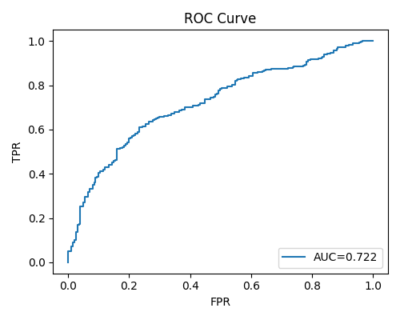
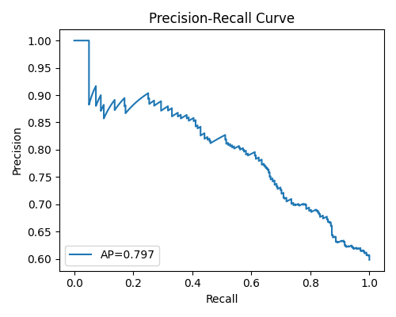
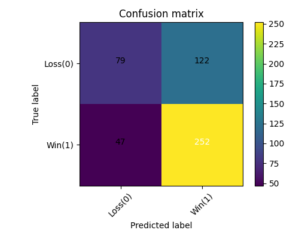
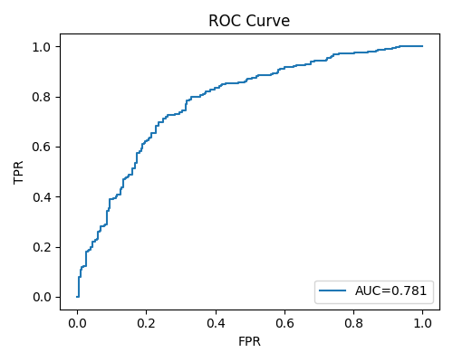
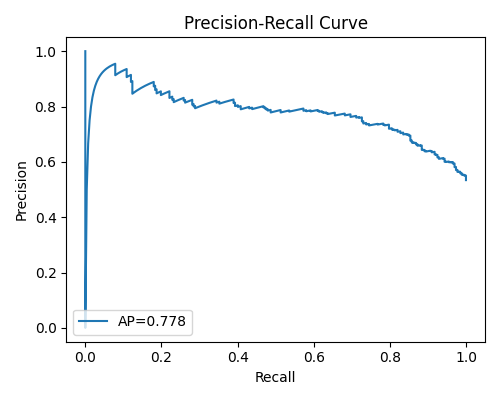
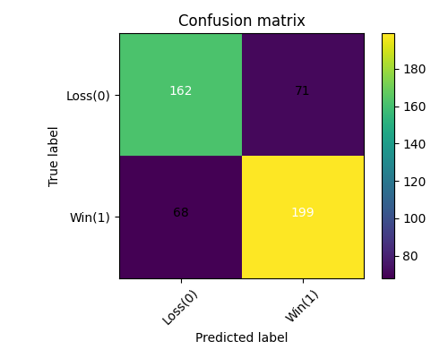
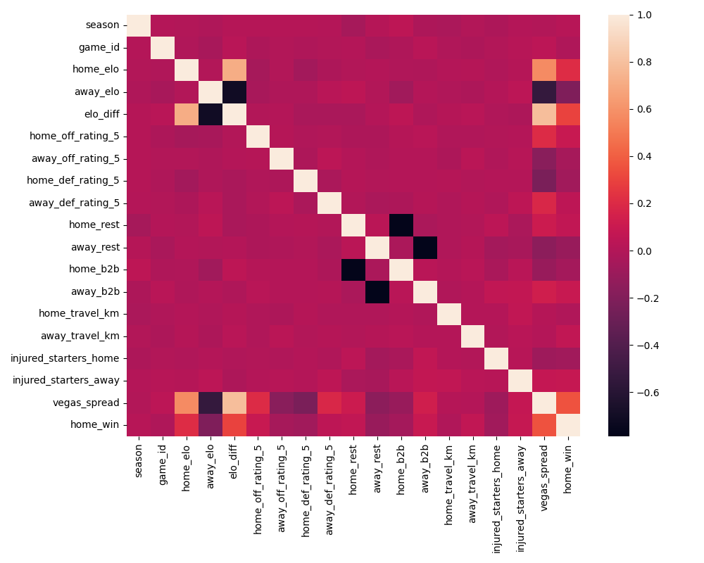
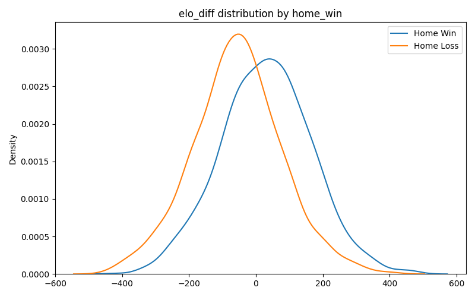

# 🏀🏈 Court & Gridiron Outcome Lab

A machine learning project that predicts **NBA and NFL home-team win probability**
from team strength, recent form, rest, travel, injuries, and the market spread.
Built with **Python, Pandas, NumPy, scikit-learn, Matplotlib, Seaborn, XGBoost**,
and an interactive **Streamlit** demo on top.

> 📖 For the project narrative, modeling decisions, and "what I'd do differently,"
> see **[`WRITEUP.md`](WRITEUP.md)**.

---

## ✨ Features

- **Synthetic data generators** for NBA and NFL — controllable signal-to-noise so
  modeling choices actually show up in the metrics.
- **Leakage-safe scikit-learn `Pipeline`s** — imputation, scaling, and one-hot
  encoding live *inside* the cross-validation loop.
- **Three hyperparameter-tuned models** — Logistic Regression (`GridSearchCV`),
  Random Forest, and XGBoost (`RandomizedSearchCV`).
- **EDA report** — correlation heatmaps and per-feature win/loss distributions.
- **Saved model artifacts** — every tuned pipeline is `joblib`-dumped to `models/`
  so the Streamlit demo can load it instantly.
- **Streamlit demo** — pick a sport + model, move sliders, watch the predicted
  home-win probability change in real time.

---

## 🚀 Quickstart

```bash
git clone https://github.com/<your-username>/Court-Gridiron-Outcome-Lab.git
cd Court-Gridiron-Outcome-Lab
python -m pip install -r requirements.txt
```

### 1 · Generate the datasets
```bash
python src/data.py --generate 4000 --seed 13 --sport nba --out data/simulated_games_nba.csv
python src/data.py --generate 4000 --seed 13 --sport nfl --out data/simulated_games_nfl.csv
```

### 2 · Run EDA
```bash
python src/eda.py --input data/simulated_games_nba.csv
python src/eda.py --input data/simulated_games_nfl.csv
```
Plots are written to [`plots/`](plots/).

### 3 · Train models
```bash
python src/train.py --input data/simulated_games_nba.csv --models lr rf xgb --cv 5 --scoring f1 --n_iter 25
python src/train.py --input data/simulated_games_nfl.csv --models lr rf xgb --cv 5 --scoring f1 --n_iter 25
```
Reports go to [`reports/`](reports/), plots to [`plots/`](plots/), trained
pipelines to [`models/`](models/).

### 4 · Launch the Streamlit demo
```bash
streamlit run app.py
```
Open <http://localhost:8501> and start moving sliders. The sidebar selects sport and
model; sliders on the page let you set Elo, recent form, rest, travel, injuries,
and the Vegas spread. The model's home/away win probabilities update on every
change.

---

## 📊 Results

Held-out 20% test split, 5-fold stratified CV on the remaining 80%, F1 used as
the search-time scoring metric.

### NBA — 4,000 simulated games

| Model | F1 | Average Precision | ROC AUC |
|-------|----|-------------------|---------|
| Logistic Regression | **0.746** | 0.790 | 0.727 |
| Random Forest       | 0.743 | **0.807** | **0.738** |
| XGBoost             | **0.749** | 0.797 | 0.722 |

| ROC | Precision-Recall | Confusion matrix |
|---|---|---|
|  |  |  |

### NFL — 4,000 simulated games

| Model | F1 | Average Precision | ROC AUC |
|-------|----|-------------------|---------|
| Logistic Regression | **0.757** | **0.834** | **0.814** |
| Random Forest       | 0.748 | 0.784 | 0.783 |
| XGBoost             | 0.741 | 0.778 | 0.781 |

| ROC | Precision-Recall | Confusion matrix |
|---|---|---|
|  |  |  |

### Feature signal (EDA)





---

## 🛠 Tech stack

- **Python 3.9+**
- **NumPy** & **Pandas** — preprocessing & feature engineering
- **scikit-learn** — pipelines, CV, search
- **XGBoost** — gradient boosting
- **Matplotlib** & **Seaborn** — EDA + evaluation plots
- **joblib** — model persistence
- **Streamlit** — interactive demo

---

## 📂 Project structure

```
Court-Gridiron-Outcome-Lab/
├── app.py                 # Streamlit demo
├── data/                  # Generated NBA/NFL datasets
├── models/                # joblib-dumped tuned pipelines
├── plots/                 # EDA + evaluation visualizations
├── reports/               # classification reports, metrics JSON
├── src/
│   ├── data.py            # Synthetic-data generators
│   ├── eda.py             # Exploratory Data Analysis
│   ├── features.py        # Column selection + preprocess pipeline
│   └── train.py           # CV-tuned training of LR / RF / XGB
├── requirements.txt
├── README.md
└── WRITEUP.md             # Project narrative
```

---

## 📜 License

MIT.
